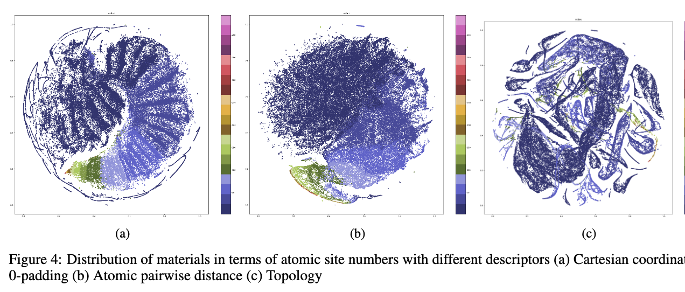

# Matglobalmapping
### Global mapping of inorganic materials

By Qinyang Li at <a href="http://mleg.cse.sc.edu" target="_blank">Machine Learning and Evolution Laboratory</a>, University of South Carolina.

Cite our work: Qinyang Li, Rongzhi Dong, Nihang Fu, Lai Wei, Sadman Sadeed Omee，Jianjun Hu*. Global mapping of structures and properties of crystal materials. 2023 Arxiv.xxx<br>


<!--  -->


### Installation
- Platform: Python 3.8, For better orginization and customization, the graph generation scripts is in jupyter notebooks
1. Create your own conda or other enviroment.

```
conda create --name globalmapping python=3.8 
conda activate globalmapping
```
2. Install `pytorch` from [pytorch website](https://pytorch.org/get-started/previous-versions/) given your python & cuda version
Since we used a pretrained model and only do evaluation, the CPU version of the Pytorch is enough for the job.
See detail about how to install the [Deeper GATGNN](https://github.com/usccolumbia/deeperGATGNN) environment.
This is a tested cpu version installation:

```
pip install torch==1.12.1+cpu torchvision==0.13.1+cpu torchaudio==0.12.1 --extra-index-url https://download.pytorch.org/whl/cpu

export TORCH=1.12.1
export CUDA=cpu 
pip install torch-scatter -f https://pytorch-geometric.com/whl/torch-${TORCH}+${CUDA}.html
pip install torch-sparse -f https://pytorch-geometric.com/whl/torch-${TORCH}+${CUDA}.html
pip install torch-cluster -f https://pytorch-geometric.com/whl/torch-${TORCH}+${CUDA}.html
pip install torch-spline-conv -f https://pytorch-geometric.com/whl/torch-${TORCH}+${CUDA}.html
pip install torch-geometric==2.1.0.post1
```
3. Install basic packages
```
pip install numpy
pip install scipy
pip install matplotlib
pip install pickle5
pip install joblib
pip install describe
pip install scikit-learn
pip install ray[default]
pip install hyperopt
pip install tensorboardX
python3.8 -m pip install colorama
pip install protobuf==3.20.*
pip install pymatgen==v2021.3.3
pip install ase
pip install ripser
```


### Datasets

Raw datasets, the whole MP feature datasets of all 7 different descriptors, and global map t-sne processed map datasets are avaliable at [dataset](Dataset/) folder. 


### Usage
There are 2 parts of our code. You can create new feature from all the descriptors or reproduce our mapping results shown in paper.
1. Generate all the descriptors feature vector for given group of materials structure infomation in format of .cif

    - [generate features](Generate_descriptor_features/)

2. Reproduce the mapping graph 
For global density and property analysis, The dataset avaliable in this respository is is enough to reproduce the global distribution map in our paper (figure 2,4,5,6).Due to the size of the generated feature the dataset avaliable in this respository is the result from T-SNE. It only contains the xy coordniates for each map.

    - [global density](https://github.com/usccolumbia/matglobalmapping/blob/main/Generate_graph_%20global_MP/allMP_global_density.ipynb) 
    - [global property](https://github.com/usccolumbia/matglobalmapping/blob/main/Generate_graph_%20global_MP/allMP_global_property.ipynb) 
      

For target group analysis WRT. global distribution(figure 3).

- your target group of materials is from MP dataset with known MP ids.The dataset avaliable in this respository is enough to reproduce the global distribution map in our paper.
    - [custom list of mpid](https://github.com/usccolumbia/matglobalmapping/blob/main/Generate_graph_%20global_MP/mpid_over_global/listmpid_over_global_density.ipynb)


For target group analysis WRT. custom there are some local distributions(figure 7). This requires download of original feature:

- Make sure your target and backgound materials are feed into the tsne toghether（normally target materials should belong to a subset of background materials).Make sure the domain of the background materials is larger than the target materials to get a good map.E.g. {ABC3 materials}<{ternary materials}

    - [custom scope](Generate_graph_local_subset/) 

    
### Sample global maps of inorganic materials

The figure displayed in our paper is avaliable at
    - [figures](Figures_used_in_paper/)


